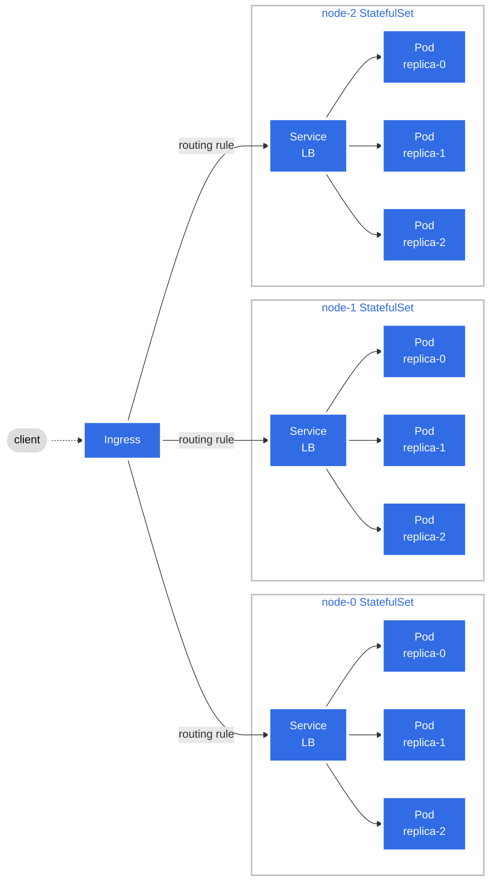

# Sharded Key-Value Store

## Features
* **Sharding**: The key-value store is sharded across multiple nodes using [Consistent Hashing with Bounded Loads](https://research.google/blog/consistent-hashing-with-bounded-loads/).
* **Replication**: The key-value store supports replication across multiple replicas on each node. The number of replicas can be configured (default: 3). It uses the [Raft Consensus Algorithm](https://raft.github.io/).
* **Load Balancing**: The key-value store uses a round-robin load balancer to distribute the requests across the replicas using the [NGINX Ingress Controller](https://kubernetes.github.io/ingress-nginx/). Leader forwarding is used to forward the requests to the leader replica.
* **Scalability**: The key-value store can be deployed on Kubernetes with a configurable number of nodes and replicas and can be changed dynamically using the [Helm](https://helm.sh/) values file. (Run `make deploy` to apply the changes after updating the [helmfile.yaml](./helmfile.yaml) file)
* **Upgradability**: The key-value store can be upgraded without any downtime using the [RollingUpdate](https://kubernetes.io/docs/tutorials/kubernetes-basics/update/update-intro/) strategy in Kubernetes. (Run `make sync` after updating the source code).
* **Fault Simulation**: The system can simulate network partitions and node failures using [Chaos Mesh](https://chaos-mesh.org/). Visit https://chaos-dashboard.svc.localho.st:8080/chaos-mesh/ to access the Chaos Mesh dashboard and experiment with different fault scenarios.
* **Tracing**: The system provides logs of traffic among all the nodes logged to the standard output. The logs can be viewed using the `stern` tool. (Run `stern -l group=node-0 -n=kvs -t=short` to view the logs of the node-0 replica group).
* **Portability**: The system can be run in any platform (Windows, macOS, Linux) with no changes to the codebase since it is built using Go and Kubernetes.


## Prerequisites (development)
1. Install [Go](https://go.dev/doc/install). Make sure to set the PATH environment variable correctly.
2. Install the [Protobuf Compiler](https://grpc.io/docs/protoc-installation).
3. Install the Go Protobuf Compiler plugins:
    ```bash
    go install google.golang.org/protobuf/cmd/protoc-gen-go@v1.28
    go install google.golang.org/grpc/cmd/protoc-gen-go-grpc@v1.2
    ```

## Prerequisites (deployment)
1. Install [Docker](https://docs.docker.com/get-docker/).
2. Install [Docker Buildx](https://github.com/docker/buildx?tab=readme-ov-file#installing).
3. Install [MiniKube](https://minikube.sigs.k8s.io/docs/start/).
4. Install [Kubectl](https://kubernetes.io/docs/tasks/tools/#kubectl).
5. Install [Helmfile](https://helmfile.readthedocs.io/en/latest/#installation).
6. Install `stern`:
    ```bash
    go install github.com/stern/stern@latest
    ```

## Repository Structure

- `cmd/`: Contains the code for CLI binaries that users can use to interact with the key-value store.
- `internal/`: Contains the core implementation of the key-value store.
  - `internal/protos/`: Contains the generated Go code for the Protobuf messages and services.
    - `fsm.proto`: Contains the proto definition for the Raft state machine.
    - `kv.proto`: Contains the proto definition for the key-value store service through which clients can interact with the key-value store.
    - `node.proto`: Contains the proto definition for the node service through which replica groups can interact with each other (for forwarding request to the node containing the required shard).
    - `replica.proto`: Contains the proto definition for the replica service through which replicas can interact with each other (for leader forwarding).
- `protos/`: Contains the Protobuf definitions for the messages and services used in the key-value store.

## Usage

### Makefile Targets

Run `make "target"` where `"target"` is one of the following:
- `deploy`: Deploy the system (Key-Value Store Server) in Kubernetes.
- `client`: Run the client.
- `clean`: Remove the system from Kubernetes.
- `sync`: Sync any changes in the system to Kubernetes.
- `dashboard`: Open the Kubernetes dashboard.
- `proto`: Generate the Go code from the Protobuf definitions.
- `fmt`: Format the Go code and helm templates before committing.

### Viewing Logs/Traces

* To view all logs of the cluster:
    ```console
    $ stern -n kvs -t=short
    ```
* To view logs of a specific replica group (e.g., node-0):
    ```console
    $ stern -l group=node-0 -n kvs -t=short
    ```
* To view logs of a specific replica (e.g., node-0-replica-0):
    ```console
    $ stern -l node-0-replica-0 -n kvs -t=short
    ```
* To remove logs of heartbeat messages add `-e="Sending heartbeat"` to the command:
    ```console
    $ stern -n kvs -t=short -e="Sending heartbeat"
    ```

## System Architecture


## Kubernetes Architecture


