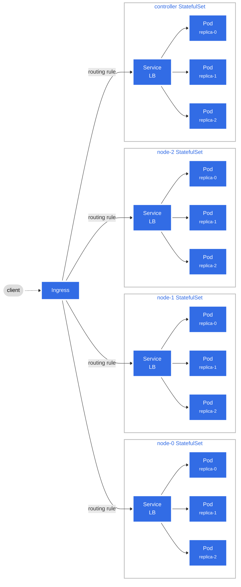

# Sharded Key-Value Store

## Roadmap
- [ ] Getting Started
  - [x] Simple RPC service to serve as a starting point.
  - [ ] Implement endpoints for a key-value store in a single node.
    - [ ] Implement `Get` endpoint.
    - [ ] Implement `Put` endpoint.
    - [ ] Implement `Delete` endpoint.
- [ ] TBD

## Prerequisites (development)
1. Install [Go](https://go.dev/doc/install). Make sure to set the PATH environment variable correctly.
2. Install the [Protobuf Compiler](https://grpc.io/docs/protoc-installation).
3. Install the Go Protobuf Compiler plugins:
    ```bash
    go install google.golang.org/protobuf/cmd/protoc-gen-go@v1.28
    go install google.golang.org/grpc/cmd/protoc-gen-go-grpc@v1.2
    ```

## Prerequisites (deployment)
1. Install [Docker](https://docs.docker.com/get-docker/).
2. Install [Docker Buildx](https://github.com/docker/buildx?tab=readme-ov-file#installing).
3. Install [MiniKube](https://minikube.sigs.k8s.io/docs/start/).
4. Install [Kubectl](https://kubernetes.io/docs/tasks/tools/#kubectl).
4. Install [Helmfile](https://helmfile.readthedocs.io/en/latest/#installation).

## Repository Structure

- `cmd/`: Contains the code for CLI binaries that users can use to interact with the key-value store.
- `internal/`: Contains the core implementation of the key-value store.
  - `internal/protos/`: Contains the generated Go code for the Protobuf messages and services.
- `protos/`: Contains the Protobuf definitions for the messages and services used in the key-value store.

## Usage

### Server
Start the key-value store server (Kubernetes):
```console
$ make deploy
```

(OR)

Start the key-value store server (Local):
```console
$ go run cmd/node/node.go -port <int> -node <int> -replica <int> -nodes <int> -replicas <int>
```

### Client
Start the key-value store client:
```console
$ go run cmd/client/client.go -port <int> -host <string>
```

Example:
```console
$ go run cmd/client/client.go -port 8080 -host node-0.kvs.svc.localho.st
```

## Makefile Targets

Run `make "target"` where `"target"` is one of the following:
- `deploy`: Deploy the system in Kubernetes.
- `clean`: Remove the system from Kubernetes.
- `sync`: Sync any changes in the system to Kubernetes.
- `dashboard`: Open the Kubernetes dashboard.
- `proto`: Generate the Go code from the Protobuf definitions.
- `fmt`: Format the Go code and helm templates before committing.

## Kubernetes Architecture


